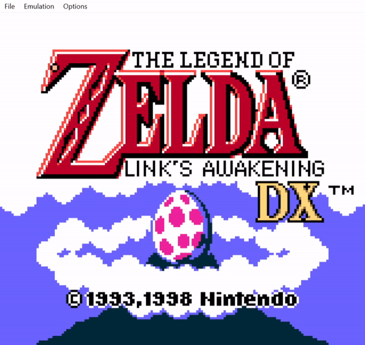

# Game Boy Color Emulator

This is a Game Boy Color emulator capable of running most commercial Game Boy and Game Boy Color games. The emulator itself is written in portable C++ and compiles to a single library. The frontend is written in Python using PyQt6 and SDL2 for audio playback. It's been tested in Windows and an Apple Silicon based Mac.

## Technical Info

The goal of this project was to create a hardware-accurate LLE Game Boy emulator. The SM83 CPU is emulated to M-cycle accuracy and has been verified with [Blargg's CPU tests](https://github.com/retrio/gb-test-roms) as well as [jsmoo's SM83 tests](https://github.com/raddad772/jsmoo/tree/main/misc/tests/GeneratedTests/sm83).

While not necessary for the vast majority of commercial games, the PPU is implemented using a [Pixel FIFO](https://gbdev.io/pandocs/pixel_fifo.html) rather than a more traditional scanline based renderer. This means that effects like mid-scanline palette changes will render properly and games like Prehistorik Man that take [full advantage of the hardware](https://eldred.fr/blog/2022/05/22/prehistorik) look correct.

The APU consists of four sound channels (2 square wave generators, 1 noise channel, and 1 sample playback channel). On real hardware, these channels are clocked at the same frequency as the CPU and output samples at various rates based on how each channel has been configured. While the APU is clocked correctly in this emulator, some liberties had to be taken to resample its output to a more reasonable sample rate. The emulator is audio driven, meaning that the whole system is advanced by the audio callback routine used to fill an audio sample buffer. The emulator calculates how many M-cycles need to run to generate a single sample (~23 M-cycles with a 44100 Hz sample rate), advances the emulator by that amount, and then gets the current output of the APU to generate a sample. This results in the APU itself being cycle accurate, but with slightly inaccurate playback.

The joypad implementation is not necessarily perfectly accurate either. On real hardware, the JOYP register would be updated in real time as buttons are pressed and released. Instead of constantly refreshing that register, the frontend provides the emulator with the current buttons being pressed each time the screen is refreshed. Then, whenever the CPU reads from JOYP, JOYP's state is updated based on the most recently provided inputs. Again, while not true to the actual hardware, there's effectively no difference since most games implement their joypad handling during their VBlank interrupt routines.

## Boot ROM

For legal reasons, the Game Boy Color's boot ROM cannot be distributed with the emulator. However, a path to a valid boot ROM can be provided in the application's preferences and it will be run before loading each game. If the boot ROM is not used, the emulator will instead set all registers accordingly based on the state of the console immediately after exiting the boot ROM.

When running original non-color Game Boy games, the boot ROM calculates a checksum based on cartridge header data and uses it to automatically colorize monochrome games. When the boot ROM is not provided this process cannot take place, so the emulator will default to a green palette replicating the look of the original Game Boy. The palette for monochrome games can be configured in the preferences using one of five presets, or a custom palette of your choice.

## Screenshots

| | | |
|:-------------------------:|:-------------------------:|:-------------------------:|
|  |  |  |
|  |   | |



https://github.com/chradajan/GameBoy/assets/9095232/ca559670-7785-457e-a31d-3421324495be

## Features

Save states

- Store up to 5 save states per game.
- Quickly create a save state by pressing a key between 1-5 and load it with Ctrl/Cmd + the corresponding number key.
- Save states cannot be created or loaded during boot ROM animation.

Game Speed

- Dynamically speed or or slow down gameplay through changing the master clock multiplier.

Sound controls

- Toggle whether individual sound channels are mixed into the final output.
- Toggle between the stereo (default) and mono audio.
- Choose sample rate used for audio playback.

Colors

- Choose between the automatic palettes generated by the boot ROM, one of five preset palettes, or generate your own palette when playing original monochrome games.
- Optionally set a palette to be used universally or set a different palette for each component rendered by the PPU (background, window, sprites).

Controls

- Supports both keyboard and Xbox controllers and allows keys to be rebound.
- Default keyboard bindings:
    - D-pad => WASD
    - Start => Enter
    - Select => Right Shift
    - B => K
    - A => L

Paths

- Set path used to store save games for battery-backed cartridges.
- Set path used to store save states.
- If these are not set, they will default to being stored in the same directory as the current game being played.
## Requirements

- [CMake 3.19+](https://cmake.org/)
- [Python](https://www.python.org/)
- C++ compiler with C++17 support


## Build Steps

To checkout and install requirements:
```
git clone https://github.com/chradajan/GameBoy.git
cd GameBoy
pip install -r requirements.txt
```

To compile the emulator library (starting from the root directory):
```
cd GameBoy
mkdir build
cd build
cmake ..
make
```

To launch from a command line (starting from the root directory):
```
python GUI/main.py
```
